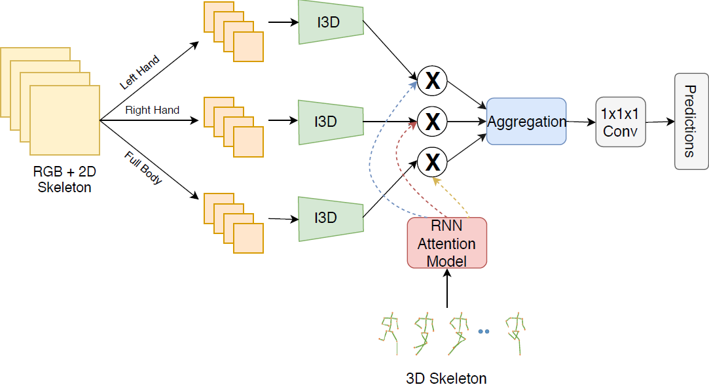

# P-I3D
## Where to focus on for Human Action Recognition?


#### REQUIRED PACKAGES AND DEPENDENCIES

* python 3.6.8
* PyTorch 1.0.1
* Torchvision 0.2.0
* Tensorflow 1.13.0 (GPU compatible)
* keras 2.3.1
* scikit-image 0.16.2
* Pillow 6.2.1
* OpenCV 4.1.2
* Cuda 10.0
* CuDNN 7.4
* tqdm 4.41.1

#### INSTALLATION INSTRUCTIONS

Ensure that Cuda 10.0 and CuDNN 7.4 are installed to use GPU capabilities.

Ensure Anaconda 4.7 or above is installed using `conda info`, else refer to the [Anaconda documentation](https://docs.anaconda.com/anaconda/install/)

The following commands can then be used to install the dependencies:

```bash
conda create --name pi3d_env tensorflow-gpu==1.13.1 keras scikit-image opencv
```
#### DATA
RGB frames for each dataset are in data/[DATASET]/[PART] folder.
Skeleton files are present in data/[DATASET]/skeleton/ folder.

The model weights while training will be stored in weights/ folder according to the model name and the corresponding logs can be found in the logs/ folder.

#### TRAINING P-I3D
Training is done in multiple stages:
1. Pretraining of I3D models (for full_body/left_hand/right_hand) can be done through the given scripts 
```bash
conda activate pi3d_env
sh i3d_train.sh [DATASET] [PROTOCOL] [PART] [NUM_CLASSES] [BATCH_SIZE] [EPOCHS]
```

2. The three layered stacked LSTM network is pretrained by following the following [code](https://github.com/srijandas07/LSTM_action_recognition).

3. The network is jointly trained using 
```bash
conda activate pi3d_env
python lstm_train_attention.py (optional arguments)
```
The testing script can be found in test.py and requires the model weights of the best epoch to be passed as an argument.
